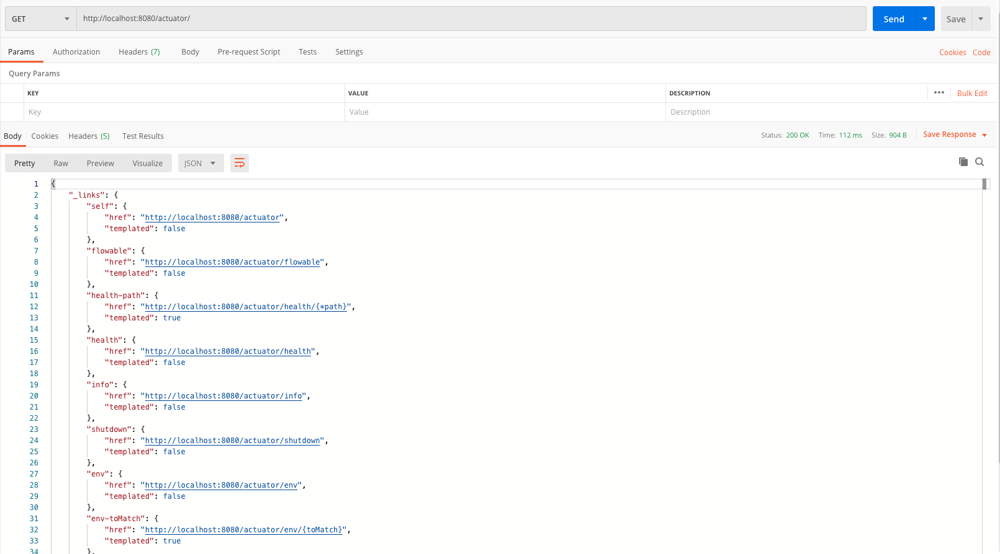
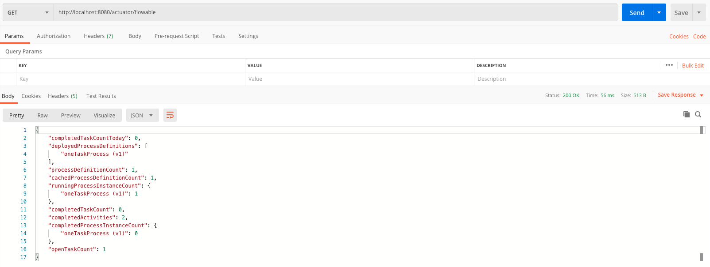
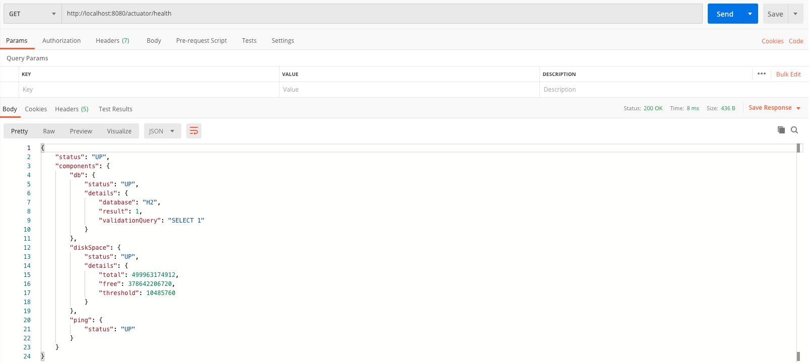

# spring-boot-flowable-bpm-integration


And inside the folder _src/main/resources/processes_, create a file named _one-task-process.bpmn20.xml_. This is a dummy process definition. The content of the file is below:

```xml
<?xml version="1.0" encoding="UTF-8"?>
<definitions xmlns="http://www.omg.org/spec/BPMN/20100524/MODEL" xmlns:flowable="http://flowable.org/bpmn" targetNamespace="Examples">
	<process id="oneTaskProcess" name="The One Task Process"> 
		<startEvent id="theStart" /> 
		<sequenceFlow id="flow1" sourceRef="theStart" targetRef="theTask" /> 
		<userTask id="theTask" name="my task" flowable:assignee="kermit" /> 
		<sequenceFlow id="flow2" sourceRef="theTask" targetRef="theEnd" /> 
		<endEvent id="theEnd" /> 
	</process> 
</definitions>
```


## Actuator Endpoints
Flowable provides a Spring Boot Actuator Endpoint that exposes information for the Processes that are running. By default, all of Actuator's endpoints are mapped to `/actuator`, and Flowable's endpoint is not the exception, as it is mapped to  `/actuator/flowable`. Spring Boot by default only exposes the  `info`  and  `health`  endpoints. In order to enable the  `flowable`  endpoint you need to add  `management.endpoint.flowable.enabled=true`  to your  `application.properties`.


Now, open your `application.properties`, and add the following lines:

```
management.endpoint.flowable.enabled=true
management.endpoints.enabled-by-default=true
management.endpoints.web.exposure.include=health,shutdown,env,info,flowable,mappings
management.endpoint.health.show-details=always
```

This will do the following:

 - Enable Flowable's actuator endpoint.
 - Enable Spring Boot's production ready endpoints.
 - Expose some specific endpoints.
 - By default, the `/health` endpoint, only tells you that the app is up, but we want to it to show a bit more of information.

Let's test the endpoint using Postman. First the `actuator` endpoint, which lists all the available endpoints.



Now, let's test Flowable's endpoint `actuator/flowable`



And finally, the `actuator/health` endpoint:




